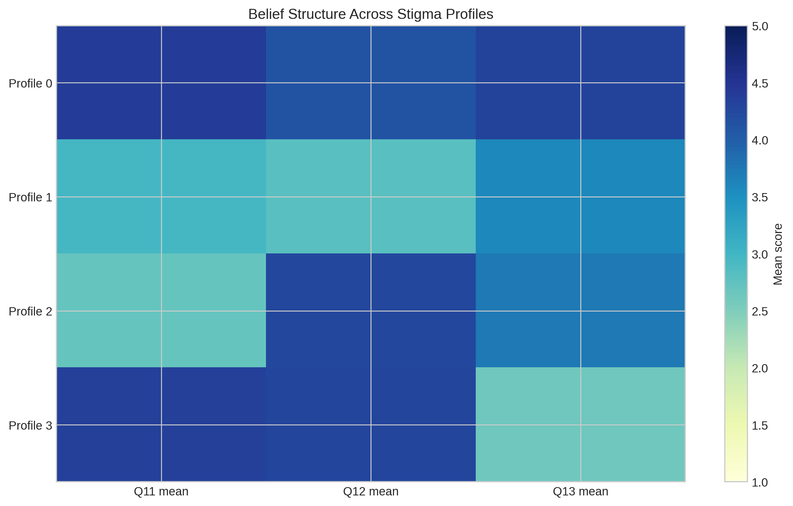

# Profile means heatmap

This chart is part of the survey analysis for *Psychiatric Medication Use and Public Acceptance in Iraq*.

**Caption:** Heatmap of profile-level means across Q11, Q12, and Q13.

**Quick analysis:** Profiles show distinct belief combinations, especially around confidence in newer medications (Q13).
