# Survey Visualization Summary

Generated from `survey_data_results.md`.

## Chart 01: Hierarchical model pseudo R² by block

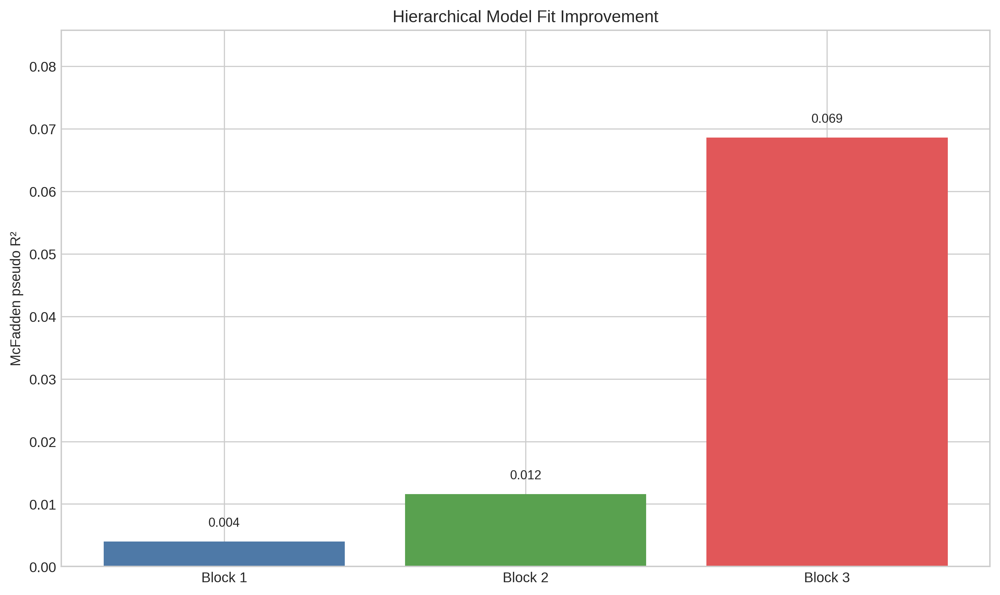

**Caption:** Block-wise McFadden pseudo R² from the hierarchical logistic regression.

**Quick analysis:** Block 3 shows the largest increase in pseudo R², indicating the most substantial improvement in model fit.

## Chart 02: LLR significance by hierarchical block

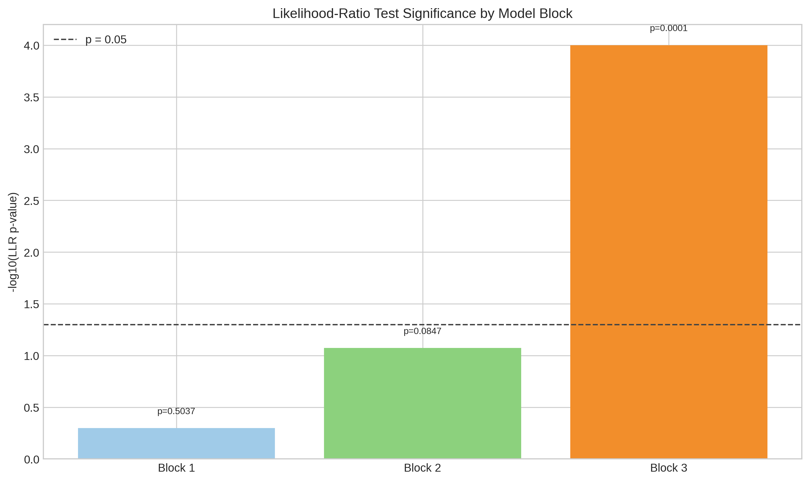

**Caption:** Transformed LLR p-values for each hierarchical block.

**Quick analysis:** Block 3 achieves statistical significance (p < 0.05), while Blocks 1 and 2 do not reach the conventional threshold.

## Chart 03: Primary adjusted OR forest plot

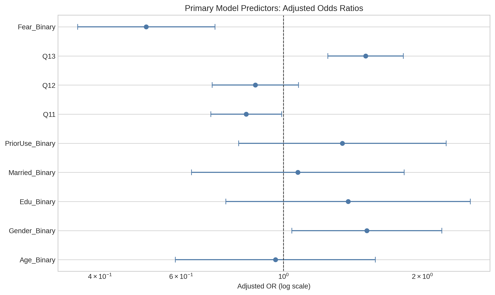

**Caption:** Adjusted odds ratios with 95% confidence intervals for Block 3 predictors.

**Quick analysis:** 4 predictors are statistically significant at p<0.05, with clear protective and risk-direction effects.

## Chart 04: Primary effect direction chart

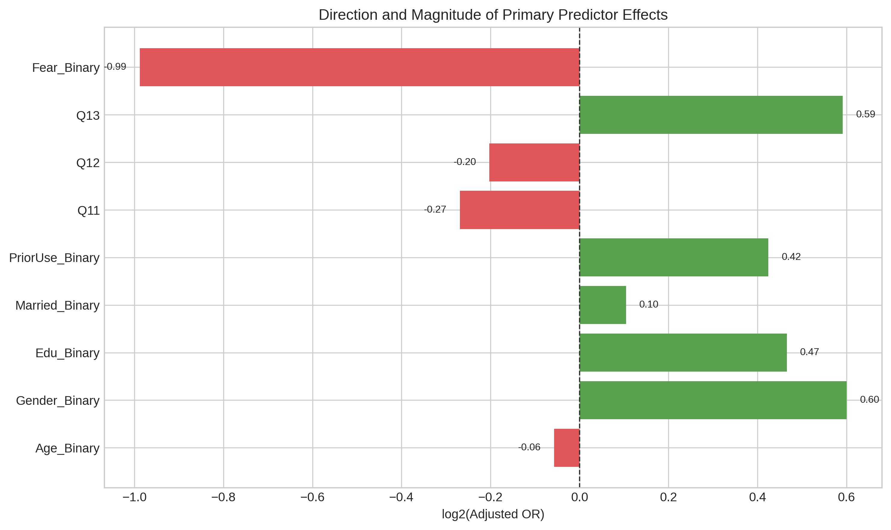

**Caption:** log2-transformed adjusted odds ratios to show effect direction around zero.

**Quick analysis:** Positive values indicate higher odds of recommending medication, while negative values indicate lower odds.

## Chart 05: Primary predictor significance ranking

**Caption:** Predictor-level p-value strength for the primary logistic model.

**Quick analysis:** Q13 and Fear_Binary exhibit the lowest p-values among adjusted predictors, indicating the most robust statistical associations.

## Chart 06: Multinomial forest plot (Q8=Yes)

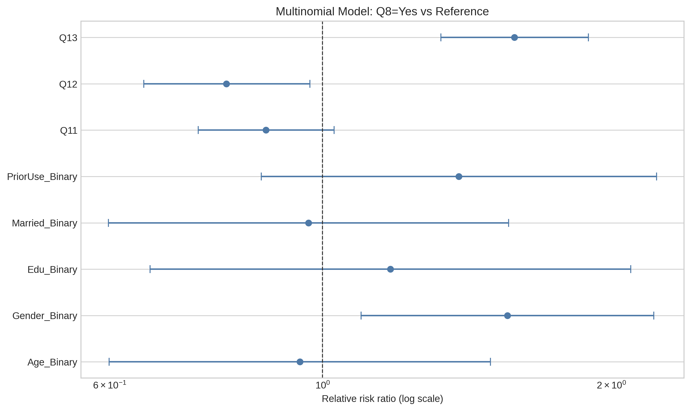

**Caption:** Relative risk ratios for the Q8=Yes outcome equation.

**Quick analysis:** Gender, Q12, and Q13 are the clearest differentiators in the Yes-vs-reference contrast.

## Chart 07: Multinomial forest plot (Q8=Not sure)

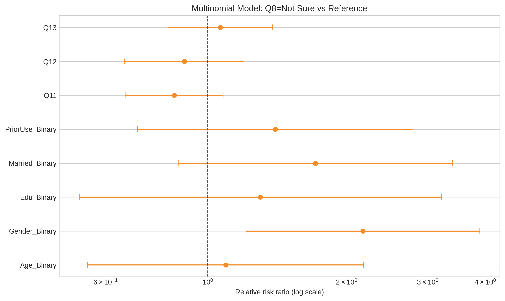

**Caption:** Relative risk ratios for the Q8=Not sure outcome equation.

**Quick analysis:** Gender remains the main significant factor in the hesitation profile.

## Chart 08: Multinomial key predictor comparison

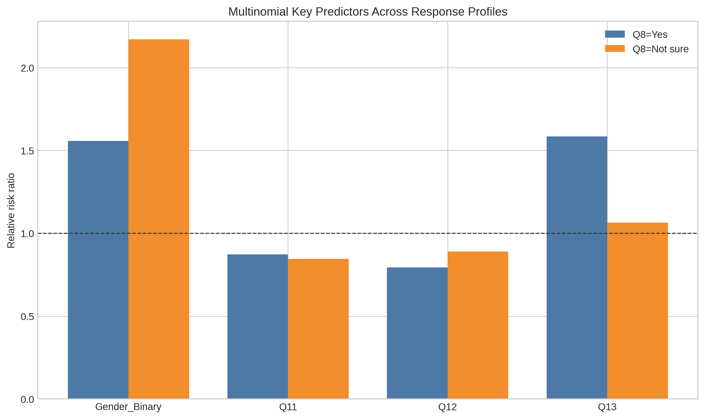

**Caption:** Side-by-side RRR values for key predictors across Yes and Not sure outcomes.

**Quick analysis:** Q13 shows a larger relative risk ratio for Yes responses, whereas Q11 and Q12 have relative risk ratios closer to 1.0 in the Not sure equation.

## Chart 09: Multinomial significance heatmap

**Caption:** Heatmap of predictor significance across multinomial outcome equations.

**Quick analysis:** Darker cells identify where evidence is strongest, especially for Q13 in the Yes equation.

## Chart 10: Contact hypothesis median comparison

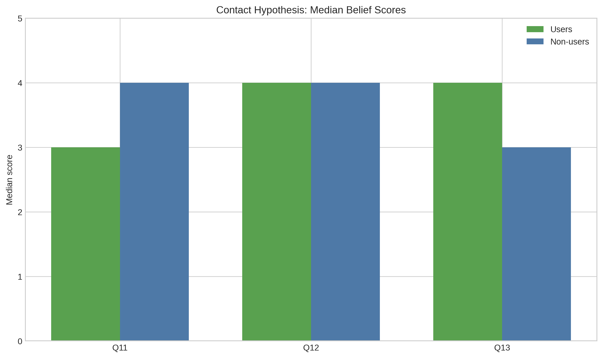

**Caption:** Users vs non-users median responses for Q11–Q13.

**Quick analysis:** Users show lower skepticism on Q11 and higher confidence on Q13 compared with non-users.

## Chart 11: Contact effect sizes

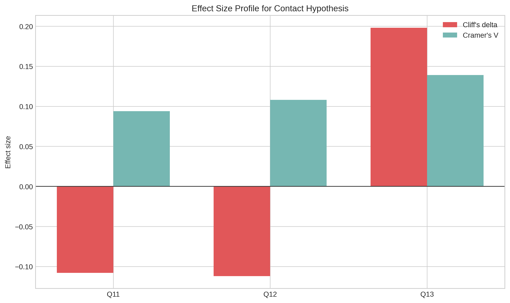

**Caption:** Effect-size metrics for group differences in Q11–Q13.

**Quick analysis:** Effects are small but consistent, with Q13 showing the strongest directional separation.

## Chart 12: Contact p-value strength

**Caption:** Statistical strength of Mann-Whitney and Chi-square tests for Q11–Q13.

**Quick analysis:** Q13 has the strongest evidence of group separation across both statistical tests.

## Chart 13: Silhouette score trend

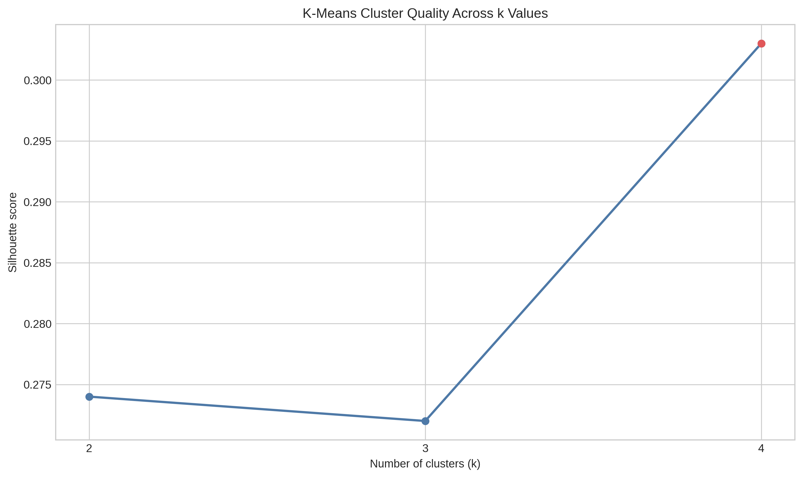

**Caption:** Silhouette scores for candidate k values in exploratory profile clustering.

**Quick analysis:** k=4 gives the best separation, matching the final model choice.

## Chart 14: Profile means heatmap

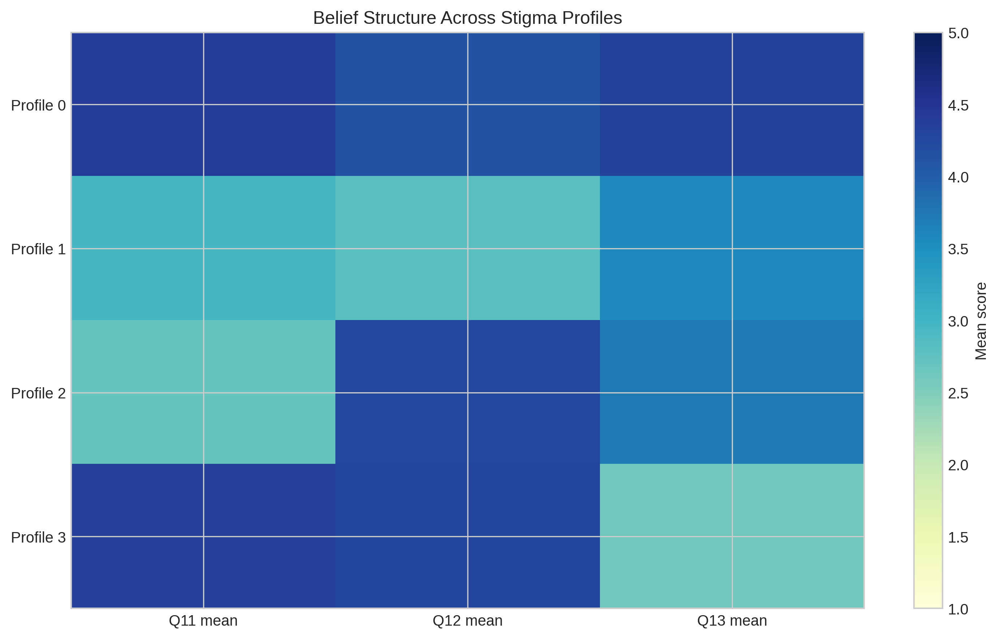

**Caption:** Heatmap of profile-level means across Q11, Q12, and Q13.

**Quick analysis:** Profiles show distinct belief combinations, especially around confidence in newer medications (Q13).

## Chart 15: Profile size distribution

**Caption:** Share of respondents (N=877) in each exploratory stigma profile.

**Quick analysis:** Profile 2 is the largest segment, but the distribution remains relatively balanced overall.
