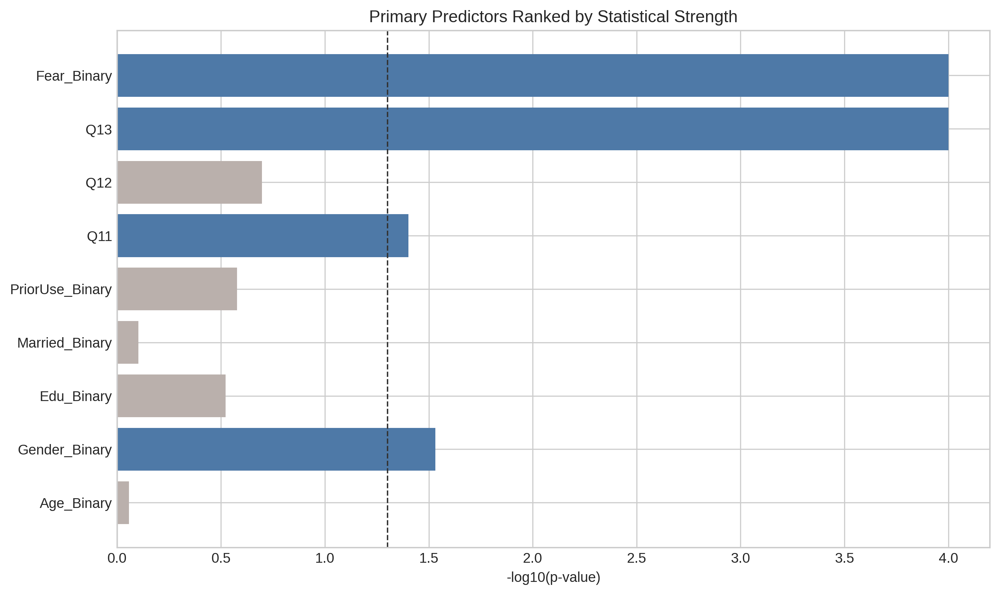

# Primary predictor significance ranking

**Caption:** Predictor-level p-value strength for the primary logistic model.

**Quick analysis:** Q13 and Fear_Binary exhibit the lowest p-values among adjusted predictors, indicating the most robust statistical associations.
